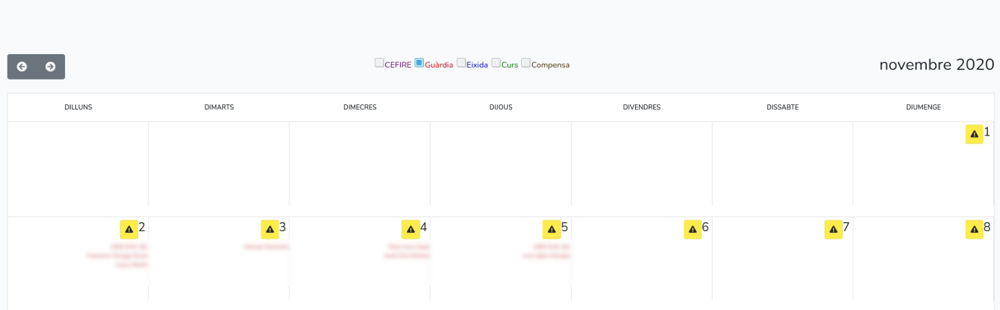
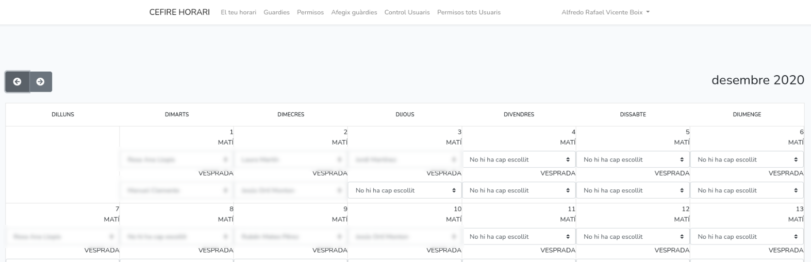
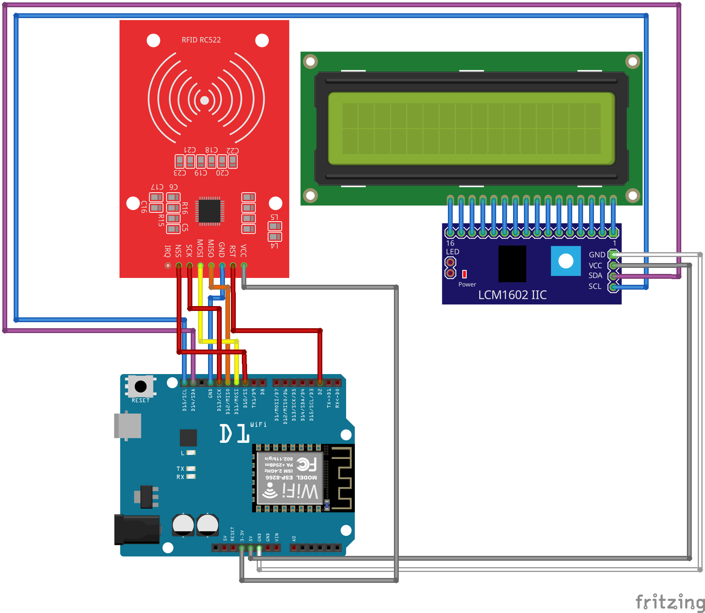
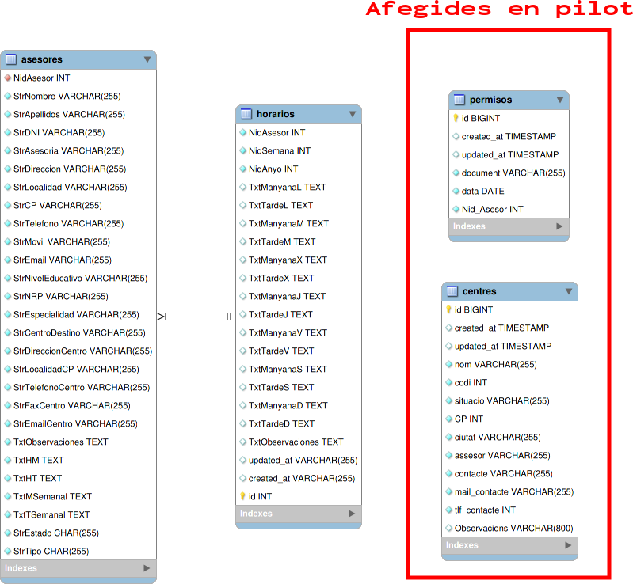
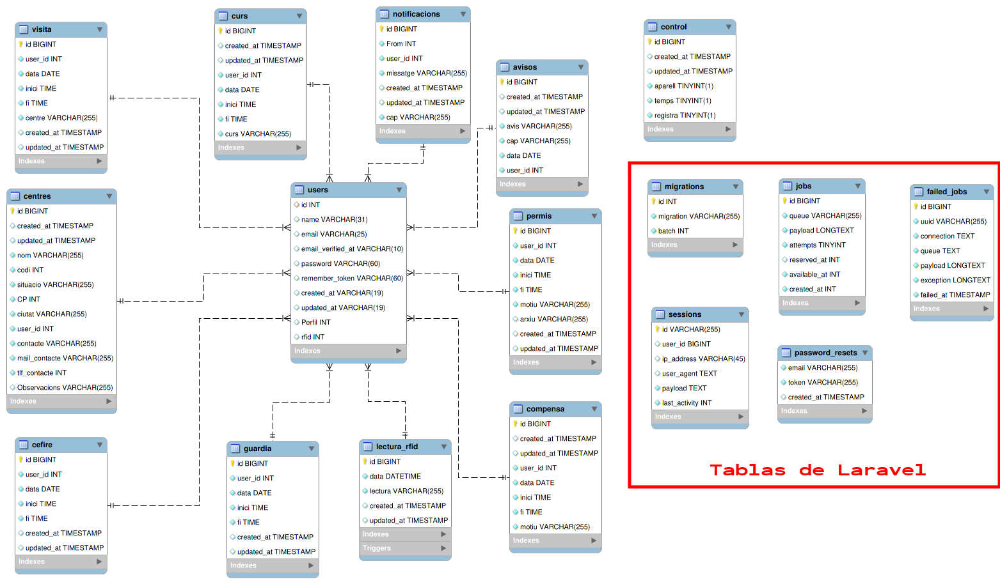

---
title: "Aplicació de fitxatges per al CEFIRE de València"
author: [Alfredo Rafael Vicente Boix]
date: "08-02-2021"
subject: "fitxar"
keywords: [fitxar, Instal·lació]
subtitle: "Posada en marxa d'una aplicació per al control de fitxatges al CEFIRE de València"
lang: "ca"
page-background: "background10.pdf"
titlepage: true,
titlepage-rule-color: "360049"
titlepage-background: "background10.pdf"
colorlinks: true
header-includes:
- |
  ```{=latex}
  \usepackage{awesomebox}
  ```
pandoc-latex-environment:
  noteblock: [note]
  tipblock: [tip]
  warningblock: [warning]
  cautionblock: [caution]
  importantblock: [important]
...

<!-- \awesomebox[violet]{2pt}{\faRocket}{violet}{Lorem ipsum…} -->

# Index {pdf:type=index}


# Introducció

Al CEFIRE de València existia una plataforma des de feia ja més de 10 anys que servia per a al control de l'horari del Assessors al CEFIRE de València. Aquesta plataforma estava allotjada a linucentres, però atès que es va llevar la plataforma sense previ avís, ens vàrem veure en la necessitat de crear una plataforma substitutòria.

A banda de tot açò, el servidor del CEFIRE s'utilitzava només com a servidor NFS, pel que calia dotar de noves funcionalitats com una plataforma de videoconferències, un control d'ocupació d'aules, a més calia que permetera allotjar la nova plataforma de control d'horaris i ser actualitzada ràpidament.

La plataforma de control de fitxatges havia de permetre guardar les dades dels darrers dos anys, a més de poder controlar quins assessors tenien guàrdies, estaven en un curs o havien sortit a fer alguna visita.

Aquesta plataforma havia de preparar-se per a un futur control de fitxatges per hores tal i com està implantat a la Conselleria o a les empreses, a més calia que complira amb les especificacions que de fitxatge que s'està demanant actualment a totes les empreses.

A més es va demanar estudiar la possibilitat de portar un control d'assignació dels centres que es duen des del CEFIRE territorial de València.
Calia muntar el model de centre de LliureX a l'Aula d'informàtica, que poguera canviar de xarxa entre la xarxa d'aules i la de secretaria per a poder fer formació específica per a Assessors.
Des del Servei de Formació del professorat es demana muntar la plataforma dspace per a fer proves.

## Proposta de realització

Per a la realització del projecte es canviarà el servidor per un Proxmox que permetrà allotjar diferents màquines. Entre altres es plategen les següents:

* Servidor NFS que es manté tal i com estava. Es fa una migració amb clonezilla.
* Servidor de l'aula d'informàtica.
* Servidor web de la plataforma de fitxatges.
* Servidor d'altres serveis.
* Servidor DSPACE

Per a muntar la plataforma de fixatges s'utilitzarà el framework **laradock**, ja que ens permetrà realitzar el desplegaments de manera senzilla ja que podrem importar directament el codi des de github.
Donat que s'ha de començar a fitxar des del començament del curs s'implementarà un prototip utilitzable des del primer moment. Aquest prototip mantindrà la base de dades d'existent, ja que es disposava d'una còpia de seguretat.
Un dels problemes principals de la base de dades és que resulta molt complex gestionar les dades, i les coses que s'han demanat al prototip resultaven complexes i difícils de realitzar. Es planteja redissenyar la base de dades per a que es faja més fàcil de gestionar i realitzar un script amb python per a fer la importació de les dades.
Una vegada acabat el prototip es realitzarà la plataforma final, en aquesta fase es plantejarà:

* Una adaptació de la base de dades que siga escalable quan canvien les circumstàncies sobre fitxatges.
* Una migració de les dades ja existents.
* Creació del prototip  d'un dispositiu que permeta el fitxatge indicant l'hora d'entrada.
* Creació d'un frontend que permeta visualitzar totes les dades i fer els fitxatges.

Per tant aquest projecte pretendrà assolir els següents objectius:

* Adaptar la xarxa del centre.
* Crear les diferents màquines virtuals per a les diferents necessitats.
* Configurar i posar en marxa les diferents plataformes.
* Crear el prototip que done suport en la major brevetat possible.
* Configurar **laradock** en les diferents màquines per a tenir una plataforma de treball diferent de la plataforma de desplegament.
* Redissenyar la base de dades que done suport a futures necessitats
* Crear una script que puga importar les dades de l'antiga base de dades a la nova.
* Creació d'un dispositiu configurable que permeta el fitxatge mitjançant NFC per a cobrir les futures necessitats de fitxatges.
* Creació de la nova plataforma de fitxatges.

Alguns dels objectius que es presenten en aquest projecte han de realitzar-se amb la major brevetat possible, ja que es necessari que estiguen disponibles ràpidament.

# Desenvolupament i planificació

Per a desenvolupar el projecte, en primer lloc cal que planifiquem el temps que podem dedicar a cadascun dels objectius. Realitzarem un projecte amb el **Projectlibre** per poder controlar el temps dedicat al projecte. Les tasques a realitzar seran:
Posada a punt de la xarxa del CEFIRE: En aquest punt posem a punt la xarxa del CEFIRE, basant-nos en el següent esquema:

 

# Planificació amb projectlibre

El primer que anem a fer és definir totes les tasques a realitzar. Així anem fent un seguiment. Les tasques que es plantegen per a realitzar el projecte són les següents:

* Instal·lació i configuració dels switchs i cablejat.
* Instal·lació i configuració de proxmox
* Adequació dels ordinadors de l’Assessoria
* Configuració i instal·lació de Servidor LliureX.
* Migració servidor NFS.
* Configuració i instal·lació de Servidor de Serveis.
* Configuració i instal·lació de servidor web: amb laradock, git, servei d’inici en systemd.

Realització de prototip de programa de fitxatges.

* Posada a punt del laradock
* Importació de la base de dades
* Esbós de la plataforma
* Creació de calendari
* Creació d’apartat de guàrdies
* Creació d’apartat de permisos
* Creació d’apartat d’advertències

Realització de prototip de dispositiu per a fitxar amb targetes/mòbil NFC

* Estudi de les diferents plataformes per a la realització del hardware.
* Investigació dels perifèrics, funcionament, llibreries i documentar*se al respecte.
* Disseny i muntatge del prototip
* Testeig del hardware
* Programació del firmware del prototip
* Testeig del software
* Solució d’errades

Creació d’script de migració de les dades a nova base de dades

* Anàlisis de la estrutura
* Disseny de la base de dades
* Creació del script amb python

La planificació del projecte queda de la següent manera:


:::note
En tot moment per a fer el seguiment del codi s'ha fet ús del github en diferents repositoris. Aquestos repositoris estan oberts i es pot comprovar el codi en tot moment.
:::

# Adequació de la xarxa

La instal·lació del Proxmox i preparació de les màquines virtuals s'ha fet ràpidament. Es crearà un enllaç en la pàgina d'entrada a la App per a poder accedir directament al Proxmox. Les màquines virtuals que hem instal·lat són les següents.

| Màquina virtual | Característiques |
| -- | -- |
| SMBServer | Conté compartició amb samba, s'ha importat amb Clonezilla |
| ServidorLliureX19 | Conté Owncloud, Jitsi i servidor web de secretaria |
| ServidorWeb | Servidor d'aplicació pilot |
| ServidorWeb2 | Servidor de l'aplicació definitiva |
| Aula1SRV | Servidor del model de centre de l'aula d'informàtica |
| dspace | Servidor de repositoris de materials: **prova pilot** |


:::warning
Estem a l'espera de rebre un altra servidor per a poder muntar un cluster amb dos ordinadors
:::

# Realització del projecte pilot del programa pilot

El projecte pilot es va realitzar en aproximadament 15 dies mantenint les mateixes característiques que l'aplicació anterior. S'afegiren altres característiques com:

* Poder afegir guàrdies per part d'un administrador
* Enviar advertències
* Pujar permís
* Altres xicotetes millores

Aquí podem veure algunes captures de pantalla de l'aplicació:





Es va realitzar amb laradock per a provar l'usabilitat de la ferramentes davant un entorn virtualitzat. A més donà un feedback dels elements que els assessors trobaven a faltar, cosa que ens va permetre adequar l'aplicació a l'usuari final.

\awesomebox[violet]{2pt}{\faGithub}{violet}{El repositori d'aquest element és: https://github.com/alviboi/cefire}

# Dispositiu de fitxatge

La plataforma utilitzada per a programar el dispositiu ha sigut **Arduino**, amb el microcontrolador ESP8266 que presenta principalment les següents característiques:

* Processador intern de 32 bits a 80 MHz i pot pujar fins a 160Mhz.
* 80K de DRAM.
* 1 Mb de memòria Flash.
* Memòria Flash gestionable desde llibreria EEPROM de 512 bytes. 
* Stack TCPIP WIFI a 2.4 Ghz.
* 30 Metres d'abast teòric.
* Full TCP/IP stack inclòs.
* Gestió completa del WIFI amb amplificador inclòs.
* 802.11 protocol i Wifi Direct (P2P) Soft-AP.
* Regulador i unitat d'alimentació inclosos.
* Suporta el bus SPI.

En el nostre cas ha sigut determinant decantar-nos per aquesta opció el fet que tingués 80k de RAM i 512 bytes de memòria interna, a més el bus SPI ens permet connectar-nos a diferents dispositius amb la mínima quantitat de cablejat. 

Finalment i després de provar varies plaques s'ha realitzat el següent disseny:



El resultat del dispositiu es pot descarregar i comprovar el seu funcionament des del següent repositori de github

\awesomebox[violet]{2pt}{\faGithub}{violet}{El repositori d'aquest element és: https://github.com/alviboi/arduino\_lector\_rfid }

Si comproveu el codi podeu veure que escriu directament directament sobre una taula de la base de dades que activa un trigger per a actualitzar la taula de fitxar. El dispositiu disposa d'un portal per a poder configurar els paràmetres de la base de dades i assignar-li una ip.

# Realització del producte final

Una vegada muntat el servidor al CEFIRE, posat en marxa l'aplicació pilot s'ha passat a dissenyar el producte final. Abans que res i per tal de tenir dades per a treballar hem realitzat el script d'importació de les dades.

## Script importació dades

La base de dades anterior era pràcticament un camp de text on s'escrivia totes les situacions. S'han agafat les paraules claus per a crear una taula per a cada element. Els elements són:

| Element | Característica |
| -- | -- |
| CEFIRE | Fitxar al CEFIRE, hi hauran dos modalitats |
| GUARDIA | Si estàs atenent al telèfon |
| PERMÍS | Per malaltia, etc... |
| COMPENSA | Si has fet hores de més i cal recuperar-les |
| CURS | Si estàs ocupat amb un curs |
| VISITA | Si has ixit a un centre o Conselleria |

Passem del següent disseny:

{ height=265px }

A un disseny més el·laborat que ens dona un major control sobre les dades:



\awesomebox[violet]{2pt}{\faGithub}{violet}{El script és importa.py que es troba al repositori: https://github.com/alviboi/script\_base\_datos }

## Aspectes tècnics a tindre en compte

L'aplicació es programarà íntegrament en **laradock** ja que ens permet tindre un entorn totalment controlat. Els containers que anem a utilitzar principalment en la base de dades són:

| Containers | Observacions |
| -- | -- |
| nginx | Ens permetrà servir la pàgina web |
| mysql | Allotjament de la base de dades |
| phpmyadmin | Per a poder controlar la base de dades |
| php-worker | Per a crear cues per a enviar mails i utilitzar websockets |
| workspace | Espai de treball |
| php-fpm | Entorn PHP necessari per a laravel |

S'han modificat els Dockerfiles de nginx per a permetre la connexió ssl amb un certificat autogenerat, el php-worker per a poder configurar el inici de les cues. A més, s'ha hagut de modificar el Dockerfile de php-fm per a poder habilitar les llibreries LDAP de php.

S'han configurat l'arxiu .env per a poder utilitzar un compte de gmail per a poder enviar correus electrònics.

Quan hem programat l'aplicació s'ha fet ús de les següents llibreries:

Per PHP:

* pusher-php-server per a utilitzar el websocket de pusher
  
Per a laravel (a banda de les que ja venen predefinides: vue.js, blade, sass, etc..):
  
* laravel-ui-uikit per a facilitar el disseny d'algunes parts
* @fortawesome/fontawesome-free per a les icones 
* axios per facilitar la comunicació en el servidor 
* pusher-js per a llegir events del websocket de pusher
* vue-chartjs per a crear gràfiques
* vue-simple-calendar per a crear les taules del calendari
* vue-toastification per a veure notificacions 
* vue-uniq-ids per a evitar la interacció no desitjada entre els diferents components
* vuejs-datepicker per a utilitzar el calendari de manera interactiva


## Disseny de l'aplicació

L'aplicació disposarà d'una pàgina d'entrada on es podran accedir a tots els serveis del CEFIRE. I es podrà accedir a l'aplicació:


Una vegada dins, ens podem logar i anem a un panell on podrem navegar pels diferents elements:


Ací

# Bibliografia i referències

(@) https://getuikit.com/docs/introduction
(@) https://laravel.com/docs/8.x/


