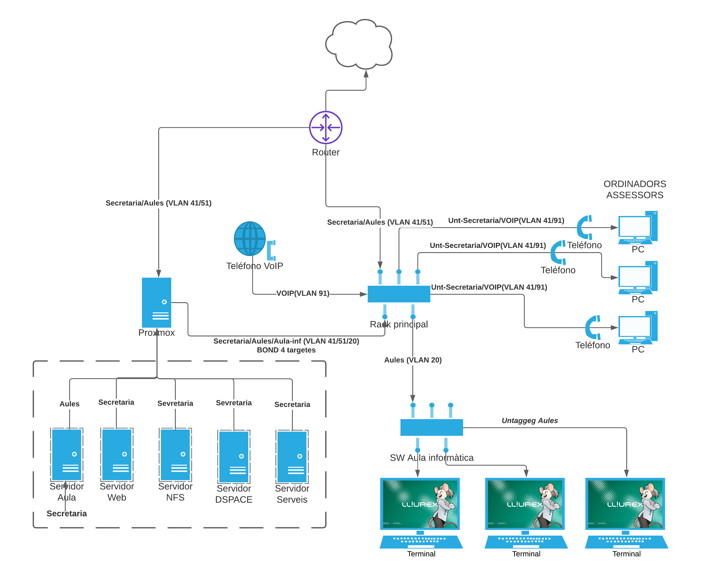

# Introducció

Al CEFIRE de València existia una plataforma des de feia ja més de 10 anys que servia per a al control de l'horari del Assessors al CEFIRE de València. Aquesta plataforma estava allotjada a linucentres, però atès que es va llevar la plataforma sense previ avís, ens vàrem veure en la necessitat de crear una plataforma substitutòria.

A banda de tot açò, el servidor del CEFIRE s'utilitzava només com a servidor NFS, pel que calia dotar de noves funcionalitats com una plataforma de videoconferències, un control d'ocupació d'aules, a més calia que permetera allotjar la nova plataforma de control d'horaris i ser actualitzada ràpidament.

La plataforma de control de fitxatges havia de permetre guardar les dades dels darrers dos anys, a més de poder controlar quins assessors tenien guàrdies, estaven en un curs o havien sortit a fer alguna visita.

Aquesta plataforma havia de preparar-se per a un futur control de fitxatges per hores tal i com està implantat a la Conselleria o a les empreses, a més calia que complira amb les especificacions que de fitxatge que s'està demanant actualment a totes les empreses.

A més es va demanar estudiar la possibilitat de portar un control d'assignació dels centres que es duen des del CEFIRE territorial de València.
Calia muntar el model de centre de LliureX a l'Aula d'informàtica, que poguera canviar de xarxa entre la xarxa d'aules i la de secretaria per a poder fer formació específica per a Assessors.
Des del Servei de Formació del professorat es demana muntar la plataforma dspace per a fer proves.

## Possibles solucions

En l'actualitat existeixen nombroses aplicacions que permeten un sistema de fitxatges, però ha sigut molt complicat trobar-en una que siga opensource per a poder adaptar-se a la realitat del CEFIRE i les més configurables que són molt completes són de pagament.

Aquestes sol·lucions no resulten viable i més quan van a emmagatzemar dades personals de funcionaris de l'Administració. Totes les dades han d'estar en servidors propietat de Conselleria.

## Proposta de realització

Per a la realització del projecte es canviarà el servidor per un Proxmox que permetrà allotjar diferents màquines. Entre altres es plategen les següents:

* Servidor NFS que es manté tal i com estava. Es fa una migració amb clonezilla.
* Servidor de l'aula d'informàtica.
* Servidor web de la plataforma de fitxatges.
* Servidor d'altres serveis.
* Servidor DSPACE

Per a muntar la plataforma de fixatges s'utilitzarà el framework **laradock**, ja que ens permetrà realitzar el desplegaments de manera senzilla ja que podrem importar directament el codi des de github.
Donat que s'ha de començar a fitxar des del començament del curs s'implementarà un prototip utilitzable des del primer moment. Aquest prototip mantindrà la base de dades d'existent, ja que es disposava d'una còpia de seguretat.
Un dels problemes principals de la base de dades és que resulta molt complex gestionar les dades, i les coses que s'han demanat al prototip resultaven complexes i difícils de realitzar. Es planteja redissenyar la base de dades per a que es faja més fàcil de gestionar i realitzar un script amb python per a fer la importació de les dades.
Una vegada acabat el prototip es realitzarà la plataforma final, en aquesta fase es plantejarà:

* Una adaptació de la base de dades que siga escalable quan canvien les circumstàncies sobre fitxatges.
* Una migració de les dades ja existents.
* Creació del prototip  d'un dispositiu que permeta el fitxatge indicant l'hora d'entrada.
* Creació d'un frontend que permeta visualitzar totes les dades i fer els fitxatges.

Per tant aquest projecte pretendrà assolir els següents objectius:

* Adaptar la xarxa del centre.
* Crear les diferents màquines virtuals per a les diferents necessitats.
* Configurar i posar en marxa les diferents plataformes.
* Crear el prototip que done suport en la major brevetat possible.
* Configurar **laradock** en les diferents màquines per a tenir una plataforma de treball diferent de la plataforma de desplegament.
* Redissenyar la base de dades que done suport a futures necessitats
* Crear una script que puga importar les dades de l'antiga base de dades a la nova.
* Creació d'un dispositiu configurable que permeta el fitxatge mitjançant NFC per a cobrir les futures necessitats de fitxatges.
* Creació de la nova plataforma de fitxatges.

Alguns dels objectius que es presenten en aquest projecte han de realitzar-se amb la major brevetat possible, ja que es necessari que estiguen disponibles ràpidament.

:::important
És important tenir en compte el lloc on es va a utilitzar el projecte. El disseny del mateix s'ha plantejat en funció del lloc de treball de l'assessor de cefire que disposa d'un Sistema Operatiu amb un LliureX 16 (Ubuntu Xenial) instal·lat com a mínim (normalment porten LliureX 19 (Ubuntu Bionic)). El monitor presenta una resolució de 1920x1080.


Tot i això i donat que encara hi han assessors que utilitzen dos monitors, un d'ells amb una resolució màxima de 1024x768, s'ha tingut en compte que l'aplicació puga adaptar-se a resolucions més baixes sense que els elements queden deformats. Es pot fer la consulta també amb el mòbil però no és usable.


S'utilitzaran elements com desplegables amb hover o drag and drop que no estan habilitats als navegadors dels mòbils.
:::

# Desenvolupament i planificació

Per a desenvolupar el projecte, en primer lloc cal que planifiquem el temps que podem dedicar a cadascun dels objectius. Realitzarem un projecte amb el **Projectlibre** per poder controlar el temps dedicat al projecte. Les tasques a realitzar seran:
Posada a punt de la xarxa del CEFIRE: En aquest punt posem a punt la xarxa del CEFIRE, basant-nos en el següent esquema:

 

## Estudi de les possibles tecnologies a utilitzar

Donat el escàs temps ( a penes 15 dies ) per a dotar d'una solució immediata al centre es varen estudiar diverses opcions:

* Crear plataforma amb PHP com la que ja hi havia abans, o amb algun framework conegut com slim o symphony
* NodeJS per a crear una aplicació pròpia de fitxatges
* Python amb flask o django, python és un programari fàcilment escalable i té nombroses llibreries
* Una solució integrada com laradock

Cadascuna de les opcions presenta nombrosos avantatges però laradock presenta una opció que permet la portabilitat íntegra de tot l'entorn a qualsevol servidor, ja que docker-compose a penes ha presentat problemes de portabilitat. A més és fàcilment escalable, com s'ha demostrat al llarg de la realització del projecte al tindre que habilitar les cues per als mails o events.

La posada en marxa del sistema es fa en minuts a través dels arxius .env, i el gestor de paqueteria composer i npm faciliten enormement la tasca d'integrar noves llibreries . Cal dir que python amb pip és un ferramenta molt potent per a gestionar les llibreries.

Finalment, flask porta integrat el seu propi ORM al mateix temps que Flask amb sqlALchemy, així mateix Laravel porta ja integrat Eloquent que facilita enormement les consultes sql i té una corba d'aprenentatge molt reduïda.

## Seguretat a tenir en compte

A més de tot això Laravel porta inclosos sistemes de seguretat fàcilment implementables com:

* csrf: Cross-site request forgeries
* sql injection d'eloquent (sempre i quan s'eviten les consultes raw)
* integració de ssl ridículament fàccil: al venir ja intengrat el docker de nginx, simplement descomentant unes línies del Dockerfile aconseguim implmentar la pàgina amb certificat.
* Hem utilitzat un self-sign certificate, la posada en marxa es de escasos minuts.
* El tenir un arxiu .env en laravel fa que es puguen excloure les dades sensibles dels repositoris.

# Planificació amb projectlibre

El primer que anem a fer és definir totes les tasques a realitzar. Així anem fent un seguiment. Les tasques que es plantegen per a realitzar el projecte són les següents:

* Instal·lació i configuració dels switchs i cablejat.
* Instal·lació i configuració de proxmox
* Adequació dels ordinadors de l’Assessoria
* Configuració i instal·lació de Servidor LliureX.
* Migració servidor NFS.
* Configuració i instal·lació de Servidor de Serveis.
* Configuració i instal·lació de servidor web: amb laradock, git, servei d’inici en systemd.

Realització de prototip de programa de fitxatges.

* Posada a punt del laradock
* Importació de la base de dades
* Esbós de la plataforma
* Creació de calendari
* Creació d’apartat de guàrdies
* Creació d’apartat de permisos
* Creació d’apartat d’advertències

Realització de prototip de dispositiu per a fitxar amb targetes/mòbil NFC

* Estudi de les diferents plataformes per a la realització del hardware.
* Investigació dels perifèrics, funcionament, llibreries i documentar*se al respecte.
* Disseny i muntatge del prototip
* Testeig del hardware
* Programació del firmware del prototip
* Testeig del software
* Solució d’errades

Creació d’script de migració de les dades a nova base de dades

* Anàlisis de la estrutura
* Disseny de la base de dades
* Creació del script amb python

La planificació del projecte queda de la següent manera:


:::note
En tot moment per a fer el seguiment del codi s'ha fet ús del github en diferents repositoris. Aquestos repositoris estan oberts i es pot comprovar el codi en tot moment.
:::

# Adequació de la xarxa

La instal·lació del Proxmox i preparació de les màquines virtuals s'ha fet ràpidament. Es crearà un enllaç en la pàgina d'entrada a la App per a poder accedir directament al Proxmox. Les màquines virtuals que hem instal·lat són les següents.

| Màquina virtual | Característiques |
| -- | -- |
| SMBServer | Conté compartició amb samba, s'ha importat amb Clonezilla |
| ServidorLliureX19 | Conté Owncloud, Jitsi i servidor web de secretaria |
| ServidorWeb | Servidor d'aplicació pilot |
| ServidorWeb2 | Servidor de l'aplicació definitiva |
| Aula1SRV | Servidor del model de centre de l'aula d'informàtica |
| dspace | Servidor de repositoris de materials: **prova pilot** |


:::warning
Estem a l'espera de rebre un altra servidor per a poder muntar un cluster amb dos ordinadors
:::

# Realització de l'aplicació pilot

El projecte pilot es va realitzar en aproximadament 15 dies mantenint les mateixes característiques que l'aplicació anterior. S'afegiren altres característiques com:

* Poder afegir guàrdies per part d'un administrador
* Enviar advertències
* Pujar permís
* Altres xicotetes millores

Aquí podem veure algunes captures de pantalla de l'aplicació:


{ height=150px }

{ height=150px }

Es va realitzar amb laradock per a provar l'usabilitat de la ferramentes davant un entorn virtualitzat. A més donà un feedback dels elements que els assessors trobaven a faltar, cosa que ens va permetre adequar l'aplicació a l'usuari final.

\awesomebox[violet]{2pt}{\faGithub}{violet}{El repositori d'aquest element és: https://github.com/alviboi/cefire}

# Dispositiu de fitxatge

La plataforma utilitzada per a programar el dispositiu ha sigut **Arduino**, amb el microcontrolador ESP8266 que presenta principalment les següents característiques:

* Processador intern de 32 bits a 80 MHz i pot pujar fins a 160Mhz.
* 80K de DRAM.
* 1 Mb de memòria Flash.
* Memòria Flash gestionable desde llibreria EEPROM de 512 bytes. 
* Stack TCPIP WIFI a 2.4 Ghz.
* 30 Metres d'abast teòric.
* Full TCP/IP stack inclòs.
* Gestió completa del WIFI amb amplificador inclòs.
* 802.11 protocol i Wifi Direct (P2P) Soft-AP.
* Regulador i unitat d'alimentació inclosos.
* Suporta el bus SPI.

En el nostre cas ha sigut determinant decantar-nos per aquesta opció el fet que tingués 80k de RAM i 512 bytes de memòria interna, a més el bus SPI ens permet connectar-nos a diferents dispositius amb la mínima quantitat de cablejat. 

Finalment i després de provar varies plaques s'ha realitzat el següent disseny:


El resultat del dispositiu es pot descarregar i comprovar el seu funcionament des del següent repositori de github

\awesomebox[violet]{2pt}{\faGithub}{violet}{Al repositori d'aquest element podem trobar l'esquema de l'aparell per a editar amb fritzing, el firmware i el trigger que s'ha d'integrar en la base de dades: https://github.com/alviboi/arduino\_lector\_rfid }

Si comproveu el codi podeu veure que escriu directament directament sobre una taula de la base de dades que activa un trigger per a actualitzar la taula de fitxar. El dispositiu disposa d'un portal per a poder configurar els paràmetres de la base de dades i assignar-li una ip.

## Seguretat

Donades les limitades capacitats de procesament del dispositiu s'han implementat algunes messures de seguretat al codi del dispositiu:

* La taula queda aïllada de la resta dels elements i l'usuari que utlitza l'aparell només té accés a eixa taula, és el trigguer qui escriu directament a la taula cefire
* El dispositiu només permet tenir una conenxió simultània, per tant només es podrà configurar des d'un dispositiu
* El form d'actualització de dades té un token amb un número aleatori creat a l'aire

```c++
  token_int = random(1, 1000000000);
  
  s = String(token_int);

/* S'afegix dins del form per a fer la petició */

 "<div><input type=\"token\" name=\"token\" value=\"" + s + "\" hidden><\/div>"
 ```
Quan li arriva la petició al mateix sistema, s'executa una funció de c++ que és la que escriu directament a la base de dades.

# Realització del producte final

Una vegada muntat el servidor al CEFIRE, posat en marxa l'aplicació pilot s'ha passat a dissenyar el producte final. Abans que res i per tal de tenir dades per a treballar hem realitzat el script d'importació de les dades.

## Script importació dades

La base de dades anterior era pràcticament un camp de text on s'escrivia totes les situacions. S'han agafat les paraules claus per a crear una taula per a cada element. Els elements són:

| Element | Característica |
| -- | -- |
| CEFIRE | Fitxar al CEFIRE, hi hauran dos modalitats |
| GUARDIA | Si estàs atenent al telèfon |
| PERMÍS | Per malaltia, etc... |
| COMPENSA | Si has fet hores de més i cal recuperar-les |
| CURS | Si estàs ocupat amb un curs |
| VISITA | Si has ixit a un centre o Conselleria |

Passem del següent disseny:

{ height=265px }

A un disseny més el·laborat que ens dona un major control sobre les dades:


:::note
Per a crear la base de dades s'ha utilitzat la feramenta de php **artisan** migrate de manera que sempre que es fan modificacions sobre alguna taula amb un simple comandament com **php artisan migrate** queda tot sincronitzat.
:::

\awesomebox[violet]{2pt}{\faGithub}{violet}{El script és importa.py que es troba al repositori: https://github.com/alviboi/script\_base\_datos }

## Aspectes tècnics a tindre en compte

L'aplicació es programarà íntegrament en **laradock** ja que ens permet tindre un entorn totalment controlat. Els containers que anem a utilitzar principalment en la base de dades són:

| Containers | Observacions |
| -- | -- |
| nginx | Ens permetrà servir la pàgina web |
| mysql | Allotjament de la base de dades |
| phpmyadmin | Per a poder controlar la base de dades |
| php-worker | Per a crear cues per a enviar mails i utilitzar websockets |
| workspace | Espai de treball |
| php-fpm | Entorn PHP necessari per a laravel |

S'han modificat els Dockerfiles de nginx per a permetre la connexió ssl amb un certificat autogenerat, el php-worker per a poder configurar el inici de les cues. A més, s'ha hagut de modificar el Dockerfile de php-fm per a poder habilitar les llibreries LDAP de php.

S'han configurat l'arxiu .env per a poder utilitzar un compte de gmail per a poder enviar correus electrònics.

Quan hem programat l'aplicació s'ha fet ús de les següents llibreries:

Per PHP:

* pusher-php-server per a utilitzar el websocket de pusher
  
Per a laravel (a banda de les que ja venen predefinides: vue.js, blade, sass, etc..):
  
* laravel-ui-uikit per a facilitar el disseny d'algunes parts
* @fortawesome/fontawesome-free per a les icones 
* axios per facilitar la comunicació en el servidor 
* pusher-js per a llegir events del websocket de pusher
* vue-chartjs per a crear gràfiques
* vue-simple-calendar per a crear les taules del calendari
* vue-toastification per a veure notificacions 
* vue-uniq-ids per a evitar la interacció no desitjada entre els diferents components
* vuejs-datepicker per a utilitzar el calendari de manera interactiva


## Disseny de l'aplicació

L'aplicació disposarà d'una pàgina d'entrada on es podran accedir a tots els serveis del CEFIRE. I es podrà accedir a l'aplicació:


Una vegada dins, ens podem logar i anem a un taulell on podrem navegar pels diferents elements:


Es pot navegar pels diferents elements de l'aplicació per la barra lateral. La part més important i per on gira tota l'aplicació és l'apartat horari. 

Cadascun dels elements el·laborats s'han realitzat utilitzant **components** de vue.js excepte la pàgina d'entrada que s'ha utilitzat blade.

\awesomebox[violet]{2pt}{\faGithub}{violet}{El repositori de l'aplicació és: https://github.com/alviboi/projecte\_ceedcv }

El codi principal podem trobar-lo a les següents carpetes:

| Carpeta | Característiques |
| -- | -- |
| /cefire/app/models | Model de tables, relacions de la base de dades | 
| /cefire/app/Http/Controllers | Controladors de les peticions |
| /cefire/app | Events, jobs, Mail, etc... s'han utilitzat |
| /cefire/database/migrations | Totes les modificacions de la base de dades |
| /cefire/resources | Estructura estàtica de l'aplicació |
| /cefire/routes | Arxius proveïdors de rutes, principalment web.php |
| /cefire/config | Arxius de configuració per a adequar l'aplicació |

:::info
S'ha tractat d'utilitzar totes les parts integrades dins de laravel per això s'ha fet ús del OMR eloquent que facilita les peticions a la base de dades i ja porta implementades messures de seguretat per a evitar el sql injection.
:::

### Element Horari

A l'element horari disposem de tots els dies de la setmana per a poder fitxar:


Es disposen de dos tipus de configuracions per a poder realitzar el fitxatge:

| Tipus | Característiques |
| -- | -- |
| Fitxar per hores | Habilita l'opció de fitxar a l'entrada i eixida |
| Fitxar per dia | El mateix però només es fitxa la presencialitat |

Quan es fitxa per hores, has de fitxar a l'entrada i a l'eixida, es pot fitxar varies vegades i t'apareix una icona avisant que encara no has fitxat

{ height=100px }

Si demanes permís, fas un curs o compenses et demanarà el motiu per a que ho especifiques. Si demanes un permís et demanarà el justificant i el motiu.

:::tip
Podem consultar el codi d'aquest element ací: 
[DiaComponent](https://github.com/alviboi/projecte\_ceedcv/blob/main/cefire/resources/js/components/DiaComponent.vue),
[FitxarComponent](https://github.com/alviboi/projecte\_ceedcv/blob/main/cefire/resources/js/components/FitxarComponent.vue )
:::


### Avisos

Només entres a l'aplicació al primer lloc on et duu és a l'apartat avisos, que són els avisos que algun assessor ha posat per tal d'informar d'alguna cosa urgent:


Aquest element es pot borrar si eres el creador o tens el Perfil d'Administrador.

:::tip
Podem consultar el codi d'aquest element ací: 
[Avisos](https://github.com/alviboi/projecte\_ceedcv/tree/main/cefire/resources/js/components/avisos)
:::

### Busca l'horari de l'assessor

Disposem de l'opció de consultar l'horari d'un assessor per a saber on ha estat o on va a estar en qualsevol moment:


:::tip
Podem consultar el codi d'aquest element ací: 
[Avisos](https://github.com/alviboi/projecte_ceedcv/blob/main/cefire/resources/js/components/HorarisComponent.vue)
:::


### Busca en horaris

Així mateix es pot consultar tots els assessors que compensen o estan realitzant un curs un determinat dia. D'aquesta manera es poden distribuir millor les hores de cadascú dins de la planificació mensual.


:::tip
Podem consultar el codi d'aquest element ací: 
[Avisos](https://github.com/alviboi/projecte_ceedcv/blob/main/cefire/resources/js/components/BuscahorariComponent.vue)
:::


### Afegix guàrdies

En aquest element a la part dreta están tots els assessors. Per a afegir una guàrdia agafes i arrastres l'assessor al dia de guàrdia que li pertoca. Una vegada fas açò el seu horari també s'actualitzarà i se li enviarà un mail amb la informació. Si vols esborrar una guàrdia ja afegida simplement fas click sobre la guàrdia i s'esborrarà. 

{ height=200px }

Els elements estàn sincronitzats amb els diferents assessors a través d'un websocket, per tant si mentre s'estàn posant guàrdies un assessor l'esborra s'actualitzarà automàticament.

:::tip
Podem consultar el codi d'aquest element ací: 
[Afegir guàrdies](https://github.com/alviboi/projecte_ceedcv/blob/main/cefire/resources/js/components/CalendarComponent.vue)
:::


### Filtra centres 

Es pot veure que apareix un llistat de tots el centres del CEFIRE. Tens un camp de busca per a filtrar segons el que necessites. A més, pots reduir el número de centres que es veuen per pàgina. 


Aquest element ha sofert diverses modificacions ja que en principi es va decidir utilitzar un component per a crear la taula, però finalment s'ha dissenyat tota amb un component de vue.

:::tip
Podem consultar el codi d'aquest element ací: 
[Centres](https://github.com/alviboi/projecte_ceedcv/tree/main/cefire/resources/js/components/Centres)
:::

### Estadística personal

Disposem d'un apartat on es pot consultar una breu estadísitica personal per a veure les hores realitzades. Tot i que no pot resultar molt útil quan estiga habilitat el fitxatge per dies, quan es fitxa per hores resulta extremadament útil.

Per defecte et trau les hores realitzades durant el mes present i les que feres tot el mes passat, pot escollir el rang de dades que vols calcular.


:::tip
Podem consultar el codi d'aquest element ací: 
[Estadístiques](https://github.com/alviboi/projecte_ceedcv/tree/main/cefire/resources/js/components/Reports)
:::

### Llistat permisos

Els administradors tindran accés a a un apartat on podran comprovar que els permisos pujats són correctes. Algunes vegades es posa el permís sense pujar l'arxiu, i després s'obliden de pujar el justificant. Es per això que es pot fer una busca d'aquells assessors que encara no tenen pujat el justificant. Sempre ve indicat amb una icona que indica que no té l'arxiu pujat.

Si es fa click sobre la icona de l'arxiu es descarregarà el permís pujat per a poder ser comprovat.


Una de les principals modificacions d'aquest element respecte a la versió pilot es l'ús d'arxius privat, l'arxiu ve en la resposta a la petició, no existeix cap accés a través del navegador per a baixa l'arxiu.

:::tip
Podem consultar el codi d'aquest element ací: 
[LlistatpermisosComponent](https://github.com/alviboi/projecte_ceedcv/blob/main/cefire/resources/js/components/LlistatpermisosComponent.vue)
:::

### Configuració

Per accedir a la pàgina de configuració fem click al següent menú:


Hi han 3 apartats de configuració. Per a importar usuari de LDAP, per a configurar el fitxatge per hores que hem comentat abans i per a habilitar el registre d'assessors. Aquesta última opció habilitat el registre d'assessors (normalment a principi de cada curs) per a que puguen inscriure's en l'aplicació.


Per a poder importar usuaris d'un LDAP cal que emplenes la IP i el usuari netadmin d'un servidor LliureX. Els usuaris que vullguen importar han de tenir el correu electrònic com el seu id, sinó no donarà l'opció d'importar-los.


Una vegada li donem a importar ens apareixerà un llistat amb tots el usuaris que es volen importar, els seleccionarem i li donarem a importar.


Una vegada importats ens apareixerà un missatge que ens confirmarà l'èxit de l'operació.


:::tip
Podem consultar el codi d'aquest element ací: 
[ConfiguracioComponent](https://github.com/alviboi/projecte_ceedcv/blob/main/cefire/resources/js/components/ConfiguracioComponent.vue)
:::

### Altres elements

S'han habilitat altres elements per a facilitar la gestió general de la plataforma:

* Es poden enviar missatges entre els diferents assessors per a avisar de qualsevol tema.
* Es pot fet un bolcat de les dades de la base de dades per a certificar els elements quan es fa un debug.
* Hi ha un apartat per filtrar centres directament amb el teu nom d'assessor.
* Pots editar les dades del teu perfil
* I els administradors poden editar les dades de tots el assessors i esborrar-los.

:::tip
Podem consultar el codi d'aquest element ací: 
[Control assessors](https://github.com/alviboi/projecte_ceedcv/blob/main/cefire/resources/js/components/ControlassComponent.vue),
[Dades Personals](https://github.com/alviboi/projecte_ceedcv/blob/main/cefire/resources/js/components/DadespersonalsComponent.vue),
[Edita el perfil](https://github.com/alviboi/projecte_ceedcv/blob/main/cefire/resources/js/components/EditaperfilComponent.vue),
[Missatges](https://github.com/alviboi/projecte_ceedcv/tree/main/cefire/resources/js/components/missatges)
:::

# Fase de desplegament

El desplegament de l'aplicació l'hem realitzar dues vegades. En un primer moment ens ha servit per a poder comprovar el correcte funcionament de l'aplicació en un entorn. Aquest desplegament ens permetrà:

* Continuar amb el desenvolupament de l'aplicació al nostre entorn de treball.
* Poder fer les actualitzacions de manera immediata al CEFIRE.
* Tindre un espai controlat que ens permetrà evitar errors de configuració

Per a desplegar l'aplicació les passes han sigut les següents:

1.- Clonar el repositori

2.- Crear les imatges necessàries amb docker

3.- Crear la base de dades

```
php artisan migrate:refresh
```
5.- Copiar els usuaris. Ha sigut necessari canviar el id (canviar el nom d'una columna)

4.- Importar les dades amb el script creat

6.- Copiar les dades de centres, s'ha exportat, canviat el nom de l'assessor pel codi e importar les dades.

7.- Instal·lar tots els paquets necessaris amb **composer update** y **npm install**.

8.- Desplegar l'aplicació en laravel: **npm run prod**

Per a facilitar l'arrancada de l'aplicació s'ha creat un arxiu: **/etc/systemd/docker-compose-cefire.service** per a poder arrancar el sistema com un servei. El contingut de l'arxiu és:


```bash
[Unit]
Description=docker-compose-cefire
Requires=docker.service network-online.target
After=docker.service network-online.target
[Service]
WorkingDirectory=/home/lliurex/laradock
Type=simple
TimeoutStartSec=1min
ExecStart=/usr/bin/docker-compose --env-file /home/lliurex/laradock/.env -f /home/lliurex/laradock/production-docker-compose.yml up nginx mysql phpmyadmin 
ExecStop=/usr/bin/docker-compose down
[Install]
WantedBy=multi-user.target
```


Finalment l'habilitem per a que arranque amb el sistema:

```
sudo systemctl enable docker-compose-cefire
```

Ara cada vegada que vullguem actualitzar el sistema només ens cal fer un **git pull** per a que s'actualitze. Cal llevar els arxius compilats per laravel per a que sincronitzen amb el repositori (per exemple public/js/app.js i els logs que sempre aniran canviant). Cada vegada que es faja una actualització cal tornar a arrancar **npm run prod**

# Futures actualitzacions

Uns dels principals motius pels quals s'ha decantat per una solució de creació pròpia és el fet de poder tenir un complet control sobre la plataforma. A més, molts cefires careixen d'una solució per a aquest problema, seria una solució fàcilment implementable a tots els cefires.

Dins de les futures millores pausibles dins de l'aplicació estarien:

* Connexió directa al sistema d'autentificació de funcionaris NAUSICAA per a poder realizar la importació de tots els assessors del CEFIRE en un sol click.
* Estadístiques generals de tots els assessors.
* Quan s'habilite el fitxatge per hores es podrien plantejar patrons de conducta per a preveure les hores que una persona va a estar disponible al CEFIRE.
* Sistema centralitzat per a importar les dades de tots els fitxatges de tots els CEFIRES cada dia
* A nivell d'ususari, el fet de tenir dia a dia 
* Exportació de documents pdf del temps que s'ha estat al CEFIRE
* Habilitar registre per certificat
* Creació d'un paquet deb per a la instal·lació de l'aplicació
* Millora de codi per a evitar duplicitats

Tots aquest element es volen implementar en qualsevol moment, ja que la premura del temps ha només ha fet que es centrar la feina en els elements veritablement indispensables.

# Conclusions

L'aplicació del fitxatges del Cefire a dia d'avui està en marxa i està preparada per a fer el salt a un sistema més efectiu que respecte la normativa vigent en la qual es regixen la majoria d'empreses privades. El desplegament del mateix es fa amb un simple click, i el disseny del dispositiu de fitxatge està ja preparat per a poder funcionar amb el prototip, encara que el més efectiu seria creat una PCB per a enssamblar-la correctament.

Cal dir que al projecte he tractat d'utilitzar la màxima quantitat de ferramentes possibles que no he pogut veure al cicle. Entenc que part del projecte és continuar amb la teua formació, i per això una ferramenta que a penes havia vist de passada com **laradock** m'ha servit de punt de partida per a familiaritzar-me més amb ella i poder veure tot el potencial que dóna, és immens. El nivell de facilitat per a desplegar, instal·lar i adequar una aplicació és pràcticament perfecte. Ja porta integrades totes les ferramentes que es poden necessitar a l'hora de fer pràcticament qualsevol tipus de projecte orientat a les aplicacions web.

Per posar un contra, podem parlar de la documentació de laradock, que tot i que no és nombrosa i no trobes mai la sol·lució exacta, podem dir que hi ha una gran comunitat darrere que manté el framework i resol ràpidament tots els teus dubtes. És una veritable llàstima que no s'haja insistit més en ferramentes com aquesta que pràcticament et faciliten la vida.

Altres ferramentes que he tractat d'utilitzar han sigut vue.js (que he vist en DIW sorprenentment), tractant de realitzar totes les parts amb aquesta llibreria, fugint de les sol·lucions que aporta **jquery**, és per això que no he utilitzat jquery en cap moment. Això sí, he utilitzat uikit fugint de bootstrap, ja que un projecte com aquest necessitaria més hores per a poder crear tota la casuística que ha aparegut, i uikit ha facilitat moltes de les parts.

# Bibliografia i referències

(@) https://getuikit.com/docs/introduction
(@) https://laravel.com/docs/8.x/
(@) https://www.npmjs.com/package/vue-simple-calendar
(@) https://laradock.io/documentation/


